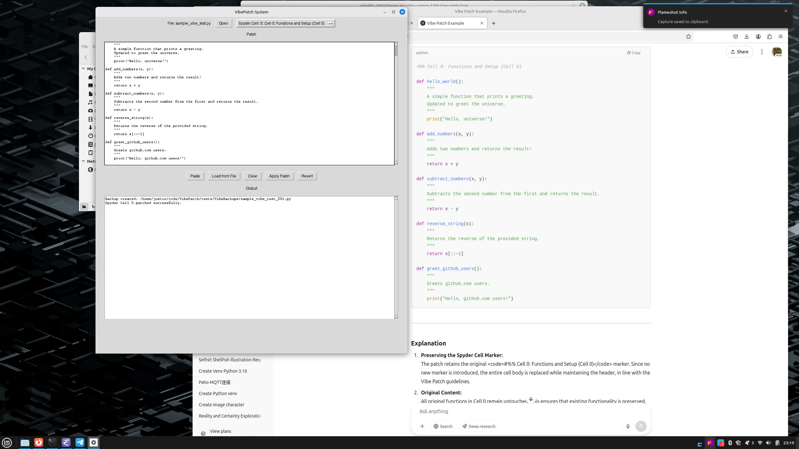

Vibe Patches
============
### Screenshots

**Initial Prompt:**

**Vibe Patch GUI:**

Overview
--------

Vibe Patches is a Python source file patching tool that applies incremental modifications to code blocks. It supports patching for:

*   Standalone functions
*   Methods within classes
*   Entire class definitions
*   Spyder-style cells (delimited by `#%%` markers)

The tool is built around precise AST-based parsing, ensuring that target blocks are identified accurately. It also provides robust backup & revert capabilities.

Features
--------

*   **AST-Based Parsing:** Accurately extracts code blocks for functions, methods, classes, and Spyder cells using Python's `ast` module.
*   **Flexible Patch Application:** If the target block does not exist, new code is inserted or appended in the appropriate location.
*   **Backup & Revert:** A backup is created before any patch is applied and is stored in the `VibeBackups` directory (up to 100 backups retained). A revert command restores the latest backup.
*   **User-Friendly Interface:** A simple tkinter GUI supports file opening, patch selection from a dropdown, editing patches while preserving formatting, and detailed output logging.
*   **Command-Line Support:** You can launch the tool with a file argument, e.g., `python vibe_patch.py my_file.py`.

File Structure
--------------

VibePatch/
├── docs
│   └── specification.html
├── LICENSE
├── README.html
├── tests
│   └── sample\_vibe\_test.py
└── vibe\_patch.py
    

Getting Started
---------------

1\. Clone the Repository:

git clone git@github.com:wyojustin/VibePatch.git
cd VibePatch
    

2\. Install Dependencies: Vibe Patches uses standard libraries (e.g., `tkinter`, `ast`), so no additional installation is required for Python 3.6+.

3\. Run the Application:

python vibe\_patch.py
    

To open a file directly from the command line:

python vibe\_patch.py path/to/your\_file.py
    

Usage
-----

*   Click the **Open** button to load a Python file.
*   Select a patchable item from the dropdown list.
*   Edit the patch text in the patch area.
*   Click **Apply Patch** to update the file or **Revert** to roll back to the latest backup.

Canonical Patch Examples
------------------------

### Example 1: Altering a Function

**Original Function:**

    
    def hello_world():
        """
        A simple function that prints a greeting?
        """
        print("Hello, world!")
        

**Vibe Patch to Update the Function:**

    
    def hello_world():
        """
        A simple function that prints a greeting.
        Updated to greet the universe.
        """
        print("Hello, universe!")
        

### Example 2: Altering a Method

**Original in class `Greeter`:**

    
    def greet(self, name):
        """
        Greets a person by name.
        """
        print("Hello, " + name + "!")
        

**Vibe Patch to Update the Method:**

    
    def Greeter.greet(self, name):
        """
        Greets a person by name.
        Updated greeting message.
        """
        print("Hi, " + name + "! Welcome!")
        

### Example 3: Adding a New Method

If a method does not exist, apply a patch that inserts it at the end of the class with a blank line preceding it.

**Vibe Patch to Add a Method to `Greeter`:**

    
    def Greeter.say_hi(self):
        """
        Says hi to the person.
        """
        print("Hi there!")
        

### Example 4: Altering a Class

**Original class `Calculator`:**

    
    class Calculator:
        def multiply(self, a, b):
            return a * b
    
        def divide(self, a, b):
            if b != 0:
                return a / b
            else:
                raise ValueError("Division by zero is not allowed!")
        

**Vibe Patch to Update the Class:**

    
    class Calculator:
        """
        A class that provides basic calculator functions.
        Updated version: includes exponentiation.
        """
        
        def multiply(self, a, b):
            return a * b
    
        def divide(self, a, b):
            if b == 0:
                raise ZeroDivisionError("Cannot divide by zero!")
            return a / b
    
        def power(self, a, b):
            return a ** b
        

### Example 5: Adding a New Class

**Vibe Patch to Add a New Class `Logger`:**

    
    class Logger:
        """
        A simple logger class to demonstrate adding a new class.
        """
        
        def log(self, message):
            print("LOG:", message)
        

### Example 6: Patching a Spyder Cell

Spyder cells are delimited by `#%%` markers. A patch targeting a Spyder cell replaces only the cell body (while preserving the marker) unless a new marker is provided.

**Original Spyder Cell (Cell 0):**

    
    #%% Cell 0: Functions and Setup
    
    def hello_world():
        print("Hello, world!")
    
    def add_numbers(x, y):
        return x + y
        

**Vibe Patch to Append New**
